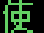

# Kanji Lookup Tables

These are so long that they're in their own file, but they follow the same general formula of how the other Graphics Offset tables work

There are three Kanji Tables, FD, FE, and FF:
* FE and FF are 512 bytes each (256 entries)
* FD is 410 bytes because `$CD-$FF` are instead used for some of the [Pascal Strings](/lookup_tables.md#pascal-string-table-part-2)
* The order is kind of odd, FE contains the start of the Kanji graphics relative to storage order in ROM, followed by FF, and FD contains the last chunk
    * However, the last 10 entries of FD map to the 10 addresses missing between the end of FE and FF @_@
    * To make this even weirder, the last 10 entries of FE map to the english letters in that were not mapped by the [Full Width Graphics Table](/lookup_tables.md#full-width-text-table)
    * Otherwise the tables match the order in ROM

## Kanji Table Lookup Table

| Index | Table Offset | Kanji Offset | Address   |
|-------|--------------|--------------|-----------|
| `$FD` | `$05A0`      | `$09A6`      | `$0589A6` |
| `$FE` | `$05A2`      | `$0BA6`      | `$058BA6` |
| `$FF` | `$05A4`      | `$0DA6`      | `$058DA6` |

* The above table is the last three rows of the [Full Width Graphics Table](/lookup_tables.md#full-width-text-table), which instead of containing a Graphics Offset, contain a Kanji Table Offset (we're hitting terminal table-ocity here folks)
* In order to find the Graphics Offset for a Kanji character, we double the byte that follows the FD/FE/FF byte (aka the index inside the Kanji Table), and add that to the Kanji Offset
* Finally, the full Address is the Graphics Offset + `$058000` just like the regular text

|Mark | Meaning |
|-----|---------|
| *   | Somewhat unsure about this identification |
| **  | Font makes this look different (the in game font follows handwritten styles usually)|
| *** | Doesn't seem to appear in any of the known sections of script data |

### Kanji Table FD

| Index | Table Offset | Graphics Offset | Address   | Image | Character | Note |
|:-----:|:------------:|:---------------:|:---------:|:-----:|:---------:|:----:|
| `$00` | `$09A6`      | `$6256`         | `$05E256` |  | 光 |
| `$01` | `$09A8`      | `$626E`         | `$05E26E` |  | 奇 |
| `$02` | `$09AA`      | `$6286`         | `$05E286` |  | 跡 |
| `$03` | `$09AC`      | `$629E`         | `$05E29E` |  | 療 |
| `$04` | `$09AE`      | `$62B6`         | `$05E2B6` |  | 結 |
| `$05` | `$09B0`      | `$62CE`         | `$05E2CE` |  | 護 |
| `$06` | `$09B2`      | `$62E6`         | `$05E2E6` |  | 内 |
| `$07` | `$09B4`      | `$62FE`         | `$05E2FE` |  | 安 |
| `$08` | `$09B6`      | `$6316`         | `$05E316` |  | 視 |
| `$09` | `$09B8`      | `$632E`         | `$05E32E` |  | 鑑 |
| `$0A` | `$09BA`      | `$6346`         | `$05E346` |  | 測 |
| `$0B` | `$09BC`      | `$635E`         | `$05E35E` |  | 炎 |
| `$0C` | `$09BE`      | `$6376`         | `$05E376` |  | 来 |
| `$0D` | `$09C0`      | `$638E`         | `$05E38E` |  | 針 |
| `$0E` | `$09C2`      | `$63A6`         | `$05E3A6` |  | 非 |
| `$0F` | `$09C4`      | `$63BE`         | `$05E3BE` |  | 常 |
| `$10` | `$09C6`      | `$63D6`         | `$05E3D6` |  | 殊 |
| `$11` | `$09C8`      | `$63EE`         | `$05E3EE` |  | 管 |
| `$12` | `$09CA`      | `$6406`         | `$05E406` |  | 果 |
| `$13` | `$09CC`      | `$641E`         | `$05E41E` |  | 級 |
| `$14` | `$09CE`      | `$6436`         | `$05E436` |  | 剤 |
| `$15` | `$09D0`      | `$644E`         | `$05E44E` |  | 弾 |
| `$16` | `$09D2`      | `$6466`         | `$05E466` |  | 懐 |
| `$17` | `$09D4`      | `$647E`         | `$05E47E` |  | 帳 |
| `$18` | `$09D6`      | `$6496`         | `$05E496` |  | 包 |
| `$19` | `$09D8`      | `$64AE`         | `$05E4AE` |  | 丁 |
| `$1A` | `$09DA`      | `$64C6`         | `$05E4C6` |  | 刀 |
| `$1B` | `$09DC`      | `$64DE`         | `$05E4DE` |  | 硫 |
| `$1C` | `$09DE`      | `$64F6`         | `$05E4F6` |  | 酸 |
| `$1D` | `$09E0`      | `$650E`         | `$05E50E` |  | 投 |
| `$1E` | `$09E2`      | `$6526`         | `$05E526` |  | 催 |
| `$1F` | `$09E4`      | `$653E`         | `$05E53E` |  | 涙 |
| `$20` | `$09E6`      | `$6556`         | `$05E556` |  | 帽 |
| `$21` | `$09E8`      | `$656E`         | `$05E56E` |  | 皮 |
| `$22` | `$09EA`      | `$6586`         | `$05E586` |  | 迷 |
| `$23` | `$09EC`      | `$659E`         | `$05E59E` |  | 彩 |
| `$24` | `$09EE`      | `$65B6`         | `$05E5B6` |  | 販 |
| `$25` | `$09F0`      | `$65CE`         | `$05E5CE` |  | 楽 |
| `$26` | `$09F2`      | `$65E6`         | `$05E5E6` |  | 誰 |
| `$27` | `$09F4`      | `$65FE`         | `$05E5FE` |  | 個 |
| `$28` | `$09F6`      | `$6616`         | `$05E616` |  | 鍵 | \*\*/\*\*\*
| `$29` | `$09F8`      | `$662E`         | `$05E62E` |  | 掛 |
| `$2A` | `$09FA`      | `$6646`         | `$05E646` |  | 扉 |
| `$2B` | `$09FC`      | `$665E`         | `$05E65E` |  | 媒 |
| `$2C` | `$09FE`      | `$6676`         | `$05E676` |  | 費 |
| `$2D` | `$0A00`      | `$668E`         | `$05E68E` |  | 続 |
| `$2E` | `$0A02`      | `$66A6`         | `$05E6A6` |  | 案 |
| `$2F` | `$0A04`      | `$66BE`         | `$05E6BE` |  | 購 |
| `$30` | `$0A06`      | `$66D6`         | `$05E6D6` |  | 却 |
| `$31` | `$0A08`      | `$66EE`         | `$05E6EE` |  | 品 |
| `$32` | `$0A0A`      | `$6706`         | `$05E706` |  | 骨 |
| `$33` | `$0A0C`      | `$671E`         | `$05E71E` |  | 菫 |
| `$34` | `$0A0E`      | `$6736`         | `$05E736` |  | 掘 |
| `$35` | `$0A10`      | `$674E`         | `$05E74E` |  | 齢 | *
| `$36` | `$0A12`      | `$6766`         | `$05E766` |  | 経 |
| `$37` | `$0A14`      | `$677E`         | `$05E77E` |  | 精 |
| `$38` | `$0A16`      | `$6796`         | `$05E796` |  | 札 |
| `$39` | `$0A18`      | `$67AE`         | `$05E7AE` |  | 湯 |
| `$3A` | `$0A1A`      | `$67C6`         | `$05E7C6` |  | 爽 |
| `$3B` | `$0A1C`      | `$67DE`         | `$05E7DE` |  | 快 |
| `$3C` | `$0A1E`      | `$67F6`         | `$05E7F6` |  | 聖 |
| `$3D` | `$0A20`      | `$680E`         | `$05E80E` |  | 麻 |
| `$3E` | `$0A22`      | `$6826`         | `$05E826` |  | 裂 |
| `$3F` | `$0A24`      | `$683E`         | `$05E83E` |  | 錯 |
| `$40` | `$0A26`      | `$6856`         | `$05E856` |  | 銀 |
| `$41` | `$0A28`      | `$686E`         | `$05E86E` |  | 刃 | **
| `$42` | `$0A2A`      | `$6886`         | `$05E886` |  | 妖 |
| `$43` | `$0A2C`      | `$689E`         | `$05E89E` |  | 輪 |
| `$44` | `$0A2E`      | `$68B6`         | `$05E8B6` |  | 編 | *
| `$45` | `$0A30`      | `$68CE`         | `$05E8CE` |  | 込 |
| `$46` | `$0A32`      | `$68E6`         | `$05E8E6` |  | 短 |
| `$47` | `$0A34`      | `$68FE`         | `$05E8FE` |  | 乾 |
| `$48` | `$0A36`      | `$692C`         | `$05E92C` |  | 晶 |
| `$49` | `$0A38`      | `$6944`         | `$05E944` |  | 害 |
| `$4A` | `$0A3A`      | `$695C`         | `$05E95C` |  | 杯 |
| `$4B` | `$0A3C`      | `$6974`         | `$05E974` |  | 塊 |
| `$4C` | `$0A3E`      | `$698C`         | `$05E98C` |  | 黄 |
| `$4D` | `$0A40`      | `$69A4`         | `$05E9A4` |  | 注 |
| `$4E` | `$0A42`      | `$69BC`         | `$05E9BC` |  | 廃 | *
| `$4F` | `$0A44`      | `$69D4`         | `$05E9D4` |  | 銃 |
| `$50` | `$0A46`      | `$69EC`         | `$05E9EC` |  | 柆 |
| `$51` | `$0A48`      | `$6A04`         | `$05EA04` |  | 型 |
| `$52` | `$0A4A`      | `$6A1C`         | `$05EA1C` |  | 黒 |
| `$53` | `$0A4C`      | `$6A34`         | `$05EA34` |  | 太 |
| `$54` | `$0A4E`      | `$6A4C`         | `$05EA4C` |  | 陽 |
| `$55` | `$0A50`      | `$6A64`         | `$05EA64` |  | 毛 |
| `$56` | `$0A52`      | `$6A7C`         | `$05EA7C` |  | 飾 |
| `$57` | `$0A54`      | `$6A94`         | `$05EA94` |  | 糸 |
| `$58` | `$0A56`      | `$6AAC`         | `$05EAAC` |  | 仏 |
| `$59` | `$0A58`      | `$6AC4`         | `$05EAC4` |  | 責 |
| `$5A` | `$0A5A`      | `$6ADC`         | `$05EADC` |  | 幻 |
| `$5B` | `$0A5C`      | `$6AF4`         | `$05EAF4` |  | 胸 |
| `$5C` | `$0A5E`      | `$6B0C`         | `$05EB0C` |  | 透 |
| `$5D` | `$0A60`      | `$6B24`         | `$05EB24` |  | 査 |
| `$5E` | `$0A62`      | `$6B3C`         | `$05EB3C` |  | 衣 |
| `$5F` | `$0A64`      | `$6B54`         | `$05EB54` |  | 茶 |
| `$60` | `$0A66`      | `$6B6C`         | `$05EB6C` |  | 指 |
| `$61` | `$0A68`      | `$6B84`         | `$05EB84` |  | 角 | **
| `$62` | `$0A6A`      | `$6B9C`         | `$05EB9C` |  | 腕 |
| `$63` | `$0A6C`      | `$6BB4`         | `$05EBB4` |  | 色 |
| `$64` | `$0A6E`      | `$6BCC`         | `$05EBCC` |  | 敵 |
| `$65` | `$0A70`      | `$6BE4`         | `$05EBE4` |  | 波 |
| `$66` | `$0A72`      | `$6BFC`         | `$05EBFC` |  | 打 |
| `$67` | `$0A74`      | `$6C14`         | `$05EC14` |  | 士 |
| `$68` | `$0A76`      | `$6C2C`         | `$05EC2C` |  | 寺 |
| `$69` | `$0A78`      | `$6C44`         | `$05EC44` |  | 三 |
| `$6A` | `$0A7A`      | `$6C5C`         | `$05EC5C` |  | 横 |
| `$6B` | `$0A7C`      | `$6C74`         | `$05EC74` |  | 銅 |
| `$6C` | `$0A7E`      | `$6C8C`         | `$05EC8C` |  | 像 |
| `$6D` | `$0A80`      | `$6CA4`         | `$05ECA4` |  | 試 |
| `$6E` | `$0A82`      | `$6CBC`         | `$05ECBC` |  | 率 |
| `$6F` | `$0A84`      | `$6CD4`         | `$05ECD4` |  | 形 |
| `$70` | `$0A86`      | `$6CEC`         | `$05ECEC` |  | 式 |
| `$71` | `$0A88`      | `$6D04`         | `$05ED04` |  | 組 |
| `$72` | `$0A8A`      | `$6D1C`         | `$05ED1C` |  | 怪 |
| `$73` | `$0A8C`      | `$6D34`         | `$05ED34` |  | 港 |
| `$74` | `$0A8E`      | `$6D4C`         | `$05ED4C` |  | 塔 |
| `$75` | `$0A90`      | `$6D64`         | `$05ED64` |  | 整 |
| `$76` | `$0A92`      | `$6D7C`         | `$05ED7C` |  | 声 |
| `$77` | `$0A94`      | `$6D94`         | `$05ED94` |  | 集 |
| `$78` | `$0A96`      | `$6DAC`         | `$05EDAC` |  | 沈 |
| `$79` | `$0A98`      | `$6DC4`         | `$05EDC4` |  | 城 | ***
| `$7A` | `$0A9A`      | `$6DDC`         | `$05EDDC` |  | 弱 |
| `$7B` | `$0A9C`      | `$6DF4`         | `$05EDF4` |  | 術 |
| `$7C` | `$0A9E`      | `$6E0C`         | `$05EE0C` |  | 味 |
| `$7D` | `$0AA0`      | `$6E24`         | `$05EE24` |  | 帰 |
| `$7E` | `$0AA2`      | `$6E3C`         | `$05EE3C` |  | 受 |
| `$7F` | `$0AA4`      | `$6E54`         | `$05EE54` |  | 突 |
| `$80` | `$0AA6`      | `$6E6C`         | `$05EE6C` |  | 然 |
| `$81` | `$0AA8`      | `$6E84`         | `$05EE84` |  | 訓 |
| `$82` | `$0AAA`      | `$6E9C`         | `$05EE9C` |  | 関 |
| `$83` | `$0AAC`      | `$6EB4`         | `$05EEB4` |  | 係 |
| `$84` | `$0AAE`      | `$6ECC`         | `$05EECC` |  | 禁 |
| `$85` | `$0AB0`      | `$6EE4`         | `$05EEE4` |  | 公 |
| `$86` | `$0AB2`      | `$6EFC`         | `$05EEFC` |  | 危 |
| `$87` | `$0AB4`      | `$6F14`         | `$05EF14` |  | 困 |
| `$88` | `$0AB6`      | `$6F2C`         | `$05EF2C` |  | 週 |
| `$89` | `$0AB8`      | `$6F44`         | `$05EF44` |  | 葉 |
| `$8A` | `$0ABA`      | `$6F5C`         | `$05EF5C` |  | 平 |
| `$8B` | `$0ABC`      | `$6F74`         | `$05EF74` |  | 和 |
| `$8C` | `$0ABE`      | `$6F8C`         | `$05EF8C` |  | 許 |
| `$8D` | `$0AC0`      | `$6FA4`         | `$05EFA4` |  | 可 |
| `$8E` | `$0AC2`      | `$6FBC`         | `$05EFBC` |  | 証 |
| `$8F` | `$0AC4`      | `$6FD4`         | `$05EFD4` |  | 送 |
| `$90` | `$0AC6`      | `$6FEC`         | `$05EFEC` |  | 艇 |
| `$91` | `$0AC8`      | `$7004`         | `$05F004` |  | 耐 |
| `$92` | `$0ACA`      | `$701C`         | `$05F01C` |  | 圧 |
| `$93` | `$0ACC`      | `$7034`         | `$05F034` |  | 傾 |
| `$94` | `$0ACE`      | `$704C`         | `$05F04C` |  | 冠 |
| `$95` | `$0AD0`      | `$7064`         | `$05F064` |  | 謎 |
| `$96` | `$0AD2`      | `$707C`         | `$05F07C` |  | 没 |
| `$97` | `$0AD4`      | `$7094`         | `$05F094` |  | 文 |
| `$98` | `$0AD6`      | `$70AC`         | `$05F0AC` |  | 古 |
| `$99` | `$0AD8`      | `$70C4`         | `$05F0C4` |  | 客 |
| `$9A` | `$0ADA`      | `$70DC`         | `$05F0DC` |  | 苦 |
| `$9B` | `$0ADC`      | `$70F4`         | `$05F0F4` |  | 労 |
| `$9C` | `$0ADE`      | `$710C`         | `$05F10C` |  | 折 |
| `$9D` | `$0AE0`      | `$7124`         | `$05F124` |  | 診 |
| `$9E` | `$0AE2`      | `$713C`         | `$05F13C` |  | 貸 |
| `$9F` | `$0AE4`      | `$7154`         | `$05F154` |  | 猛 |
| `$A0` | `$0AE6`      | `$716C`         | `$05F16C` |  | 状 |
| `$A1` | `$0AE8`      | `$7184`         | `$05F184` |  | 態 |
| `$A2` | `$0AEA`      | `$719C`         | `$05F19C` |  | 単 |
| `$A3` | `$0AEC`      | `$71B4`         | `$05F1B4` |  | 件 |
| `$A4` | `$0AEE`      | `$71CC`         | `$05F1CC` |  | 両 |
| `$A5` | `$0AF0`      | `$71E4`         | `$05F1E4` |  | 丈 |
| `$A6` | `$0AF2`      | `$71FC`         | `$05F1FC` |  | 夫 |
| `$A7` | `$0AF4`      | `$7214`         | `$05F214` |  | 例 |
| `$A8` | `$0AF6`      | `$722C`         | `$05F22C` |  | 原 |
| `$A9` | `$0AF8`      | `$7244`         | `$05F244` |  | 始 |
| `$AA` | `$0AFA`      | `$725C`         | `$05F25C` |  | 兄 |
| `$AB` | `$0AFC`      | `$7274`         | `$05F274` |  | 細 |
| `$AC` | `$0AFE`      | `$728C`         | `$05F28C` |  | 胞 |
| `$AD` | `$0B00`      | `$72A4`         | `$05F2A4` |  | 専 |
| `$AE` | `$0B02`      | `$72BC`         | `$05F2BC` |  | 呼 |
| `$AF` | `$0B04`      | `$72D4`         | `$05F2D4` |  | 浄 |
| `$B0` | `$0B06`      | `$72EC`         | `$05F2EC` |  | 営 |
| `$B1` | `$0B08`      | `$7304`         | `$05F304` |  | 錠 |
| `$B2` | `$0B0A`      | `$731C`         | `$05F31C` |  | 脳 |
| `$B3` | `$0B0C`      | `$7334`         | `$05F334` |  | 等 |
| `$B4` | `$0B0E`      | `$734C`         | `$05F34C` |  | 座 |
| `$B5` | `$0B10`      | `$7364`         | `$05F364` |  | 標 |
| `$B6` | `$0B12`      | `$737C`         | `$05F37C` |  | 即 |
| `$B7` | `$0B14`      | `$7394`         | `$05F394` |  | 反 |
| `$B8` | `$0B16`      | `$73AC`         | `$05F3AC` |  | 周 |
| `$B9` | `$0B18`      | `$73C4`         | `$05F3C4` |  | 囲 |
| `$BA` | `$0B1A`      | `$73DC`         | `$05F3DC` |  | 召 |
| `$BB` | `$0B1C`      | `$73F4`         | `$05F3F4` |  | 喚 |
| `$BC` | `$0B1E`      | `$740C`         | `$05F40C` |  | 遠 |
| `$BD` | `$0B20`      | `$7424`         | `$05F424` |  | 効 |
| `$BE` | `$0B22`      | `$743C`         | `$05F43C` |  | 勉 |
| `$BF` | `$0B24`      | `$7454`         | `$05F454` |  | 憩 |
| `$C0` | `$0B26`      | `$746C`         | `$05F46C` |  | 相 |
| `$C1` | `$0B28`      | `$7484`         | `$05F484` |  | 我 |
| `$C2` | `$0B2A`      | `$749C`         | `$05F49C` |  | 倉 |
| `$C3` | `$0B2C`      | `$4966`         | `$05C966` |  | 歩 |
| `$C4` | `$0B2E`      | `$497E`         | `$05C97E` |  | 預 |
| `$C5` | `$0B30`      | `$4996`         | `$05C996` |  | 頼 |
| `$C6` | `$0B32`      | `$49AE`         | `$05C9AE` |  | 狂 |
| `$C7` | `$0B34`      | `$49C6`         | `$05C9C6` |  | 失 |
| `$C8` | `$0B36`      | `$49DE`         | `$05C9DE` |  | 紙 |
| `$C9` | `$0B38`      | `$49F6`         | `$05C9F6` |  | 凍 |
| `$CA` | `$0B3A`      | `$4A0E`         | `$05CA0E` |  | 誷 |
| `$CB` | `$0B3C`      | `$4A26`         | `$05CA26` |  | 真 |
| `$CC` | `$0B3E`      | `$4A3E`         | `$05CA3E` |  | 同 |

### Kanji Table FE

| Index | Table Offset | Graphics Offset | Address   | Image | Character | Note |
|:-----:|:------------:|:---------------:|:---------:|:-----:|:---------:|:----:|
| `$00` | `$0BA6`      | `$3256`         | `$05B256` |  | 上 |
| `$01` | `$0BA8`      | `$326E`         | `$05B26E` |  | 下 |
| `$02` | `$0BAA`      | `$3286`         | `$05B286` |  | 攻 |
| `$03` | `$0BAC`      | `$329E`         | `$05B29E` |  | 防 |
| `$04` | `$0BAE`      | `$32B6`         | `$05B2B6` |  | 早 |
| `$05` | `$0BB0`      | `$32CE`         | `$05B2CE` |  | 運 |
| `$06` | `$0BB2`      | `$32E6`         | `$05B2E6` |  | 値 |
| `$07` | `$0BB4`      | `$32FE`         | `$05B2FE` |  | 協 |
| `$08` | `$0BB6`      | `$3316`         | `$05B316` |  | 夕 |
| `$09` | `$0BB8`      | `$332E`         | `$05B32E` |  | 報 |
| `$0A` | `$0BBA`      | `$3346`         | `$05B346` |  | 泊 |
| `$0B` | `$0BBC`      | `$335E`         | `$05B35E` |  | 復 |
| `$0C` | `$0BBE`      | `$3376`         | `$05B376` |  | 録 |
| `$0D` | `$0BC0`      | `$338E`         | `$05B38E` |  | 灯 |
| `$0E` | `$0BC2`      | `$33A6`         | `$05B3A6` |  | 字 |
| `$0F` | `$0BC4`      | `$33BE`         | `$05B3BE` |  | 休 |
| `$10` | `$0BC6`      | `$33D6`         | `$05B3D6` |  | 校 |
| `$11` | `$0BC8`      | `$33EE`         | `$05B3EE` |  | 終 |
| `$12` | `$0BCA`      | `$3406`         | `$05B406` |  | 恩 |
| `$13` | `$0BCC`      | `$341E`         | `$05B41E` |  | 胴 |
| `$14` | `$0BCE`      | `$3436`         | `$05B436` |  | 勇 |
| `$15` | `$0BD0`      | `$344E`         | `$05B44E` |  | 定 |
| `$16` | `$0BD2`      | `$3466`         | `$05B466` |  | 青 |
| `$17` | `$0BD4`      | `$347E`         | `$05B47E` |  | 宿 |
| `$18` | `$0BD6`      | `$3496`         | `$05B496` |  | 階 |
| `$19` | `$0BD8`      | `$34AE`         | `$05B4AE` |  | 段 |
| `$1A` | `$0BDA`      | `$34C6`         | `$05B4C6` |  | 室 |
| `$1B` | `$0BDC`      | `$34DE`         | `$05B4DE` |  | 矢 |
| `$1C` | `$0BDE`      | `$34F6`         | `$05B4F6` |  | 商 |
| `$1D` | `$0BE0`      | `$350E`         | `$05B50E` |  | 児 |
| `$1E` | `$0BE2`      | `$3526`         | `$05B526` |  | 星 |
| `$1F` | `$0BE4`      | `$353E`         | `$05B53E` |  | 価 |
| `$20` | `$0BE6`      | `$3556`         | `$05B556` |  | 線 |
| `$21` | `$0BE8`      | `$356E`         | `$05B56E` |  | 服 |
| `$22` | `$0BEA`      | `$3586`         | `$05B586` |  | 額 |
| `$23` | `$0BEC`      | `$359E`         | `$05B59E` |  | 途 |
| `$24` | `$0BEE`      | `$35B6`         | `$05B5B6` |  | 任 |
| `$25` | `$0BF0`      | `$35CE`         | `$05B5CE` |  | 王 |
| `$26` | `$0BF2`      | `$35E6`         | `$05B5E6` |  | 玉 |
| `$27` | `$0BF4`      | `$35FE`         | `$05B5FE` |  | 音 |
| `$28` | `$0BF6`      | `$3616`         | `$05B616` |  | 操 |
| `$29` | `$0BF8`      | `$362E`         | `$05B62E` |  | 科 |
| `$2A` | `$0BFA`      | `$3646`         | `$05B646` |  | 犯 |
| `$2B` | `$0BFC`      | `$365E`         | `$05B65E` |  | 脱 |
| `$2C` | `$0BFE`      | `$3676`         | `$05B676` |  | 瞬 |
| `$2D` | `$0C00`      | `$368E`         | `$05B68E` |  | 昇 |
| `$2E` | `$0C02`      | `$36A6`         | `$05B6A6` |  | 選 |
| `$2F` | `$0C04`      | `$36BE`         | `$05B6BE` |  | 空 | **
| `$30` | `$0C06`      | `$36D6`         | `$05B6D6` |  | 岸 |
| `$31` | `$0C08`      | `$36EE`         | `$05B6EE` |  | 信 | **
| `$32` | `$0C0A`      | `$3706`         | `$05B706` |  | 師 |
| `$33` | `$0C0C`      | `$371E`         | `$05B71E` |  | 果 |
| `$34` | `$0C0E`      | `$3736`         | `$05B736` |  | 唯 |
| `$35` | `$0C10`      | `$374E`         | `$05B74E` |  | 向 |
| `$36` | `$0C12`      | `$3766`         | `$05B766` |  | 属 |
| `$37` | `$0C14`      | `$377E`         | `$05B77E` |  | 半 |
| `$38` | `$0C16`      | `$3796`         | `$05B796` |  | 離 |
| `$39` | `$0C18`      | `$37AE`         | `$05B7AE` |  | 亜 |
| `$3A` | `$0C1A`      | `$37C6`         | `$05B7C6` |  | 紀 |
| `$3B` | `$0C1C`      | `$37DE`         | `$05B7DE` |  | 御 |
| `$3C` | `$0C1E`      | `$37F6`         | `$05B7F6` |  | 次 |
| `$3D` | `$0C20`      | `$380E`         | `$05B80E` |  | 沼 |
| `$3E` | `$0C22`      | `$3826`         | `$05B826` |  | 虫 |
| `$3F` | `$0C24`      | `$383E`         | `$05B83E` |  | 液 |
| `$40` | `$0C26`      | `$3856`         | `$05B856` |  | 素 |
| `$41` | `$0C28`      | `$386E`         | `$05B86E` |  | 第 |
| `$42` | `$0C2A`      | `$3886`         | `$05B886` |  | 万 |
| `$43` | `$0C2C`      | `$389E`         | `$05B89E` |  | 交 |
| `$44` | `$0C2E`      | `$38B6`         | `$05B8B6` |  | 産 |
| `$45` | `$0C30`      | `$38CE`         | `$05B8CE` |  | 除 |
| `$46` | `$0C32`      | `$38E6`         | `$05B8E6` |  | 頃 |
| `$47` | `$0C34`      | `$38FE`         | `$05B8FE` |  | 争 |
| `$48` | `$0C36`      | `$3916`         | `$05B916` |  | 環 |
| `$49` | `$0C38`      | `$392E`         | `$05B92E` |  | 速 |
| `$4A` | `$0C3A`      | `$3946`         | `$05B946` |  | 別 |
| `$4B` | `$0C3C`      | `$395E`         | `$05B95E` |  | 建 |
| `$4C` | `$0C3E`      | `$3976`         | `$05B976` |  | 誕 | *
| `$4D` | `$0C40`      | `$398E`         | `$05B98E` |  | 溝 |
| `$4E` | `$0C42`      | `$39A6`         | `$05B9A6` |  | ニ |
| `$4F` | `$0C44`      | `$39BE`         | `$05B9BE` |  | 面 |
| `$50` | `$0C46`      | `$39D6`         | `$05B9D6` |  | 白 |
| `$51` | `$0C48`      | `$39EE`         | `$05B9EE` |  | 退 |
| `$52` | `$0C4A`      | `$3A06`         | `$05BA06` |  | 幽 | *
| `$53` | `$0C4C`      | `$3A1E`         | `$05BA1E` |  | 野 |
| `$54` | `$0C4E`      | `$3A36`         | `$05BA36` |  | 吸 |
| `$55` | `$0C50`      | `$3A4E`         | `$05BA4E` |  | 移 |
| `$56` | `$0C52`      | `$3A66`         | `$05BA66` |  | 貯 |
| `$57` | `$0C54`      | `$3A7E`         | `$05BA7E` |  | 池 |
| `$58` | `$0C56`      | `$3A96`         | `$05BA96` |  | 登 |
| `$59` | `$0C58`      | `$3AAE`         | `$05BAAE` |  | 得 |
| `$5A` | `$0C5A`      | `$3AC6`         | `$05BAC6` |  | 森 |
| `$5B` | `$0C5C`      | `$3ADE`         | `$05BADE` |  | 法 |
| `$5C` | `$0C5E`      | `$3AF6`         | `$05BAF6` |  | 初 |
| `$5D` | `$0C60`      | `$3B0E`         | `$05BB0E` |  | 収 |
| `$5E` | `$0C62`      | `$3B26`         | `$05BB26` |  | 濃 |
| `$5F` | `$0C64`      | `$3B3E`         | `$05BB3E` |  | 縮 |
| `$60` | `$0C66`      | `$3B56`         | `$05BB56` |  | 魚 |
| `$61` | `$0C68`      | `$3B6E`         | `$05BB6E` |  | 月 |
| `$62` | `$0C6A`      | `$3B86`         | `$05BB86` |  | 払 |
| `$63` | `$0C6C`      | `$3B9E`         | `$05BB9E` |  | 官 |
| `$64` | `$0C6E`      | `$3BB6`         | `$05BBB6` |  | 倍 |
| `$65` | `$0C70`      | `$3BCE`         | `$05BBCE` |  | 押 |
| `$66` | `$0C72`      | `$3BE6`         | `$05BBE6` |  | 限 |
| `$67` | `$0C74`      | `$3BFE`         | `$05BBFE` |  | 種 |
| `$68` | `$0C76`      | `$3C16`         | `$05BC16` |  | 陸 |
| `$69` | `$0C78`      | `$3C2E`         | `$05BC2E` |  | 越 |
| `$6A` | `$0C7A`      | `$3C46`         | `$05BC46` |  | 点 |
| `$6B` | `$0C7C`      | `$3C5E`         | `$05BC5E` |  | 存 |
| `$6C` | `$0C7E`      | `$3C76`         | `$05BC76` |  | 違 |
| `$6D` | `$0C80`      | `$3C8E`         | `$05BC8E` |  | 仮 |
| `$6E` | `$0C82`      | `$3CA6`         | `$05BCA6` |  | 図 |
| `$6F` | `$0C84`      | `$3CBE`         | `$05BCBE` |  | 植 |
| `$70` | `$0C86`      | `$3CD6`         | `$05BCD6` |  | 鬼 |
| `$71` | `$0C88`      | `$3CEE`         | `$05BCEE` |  | 他 |
| `$72` | `$0C8A`      | `$3D06`         | `$05BD06` |  | 億 | *
| `$73` | `$0C8C`      | `$3D1E`         | `$05BD1E` |  | 名 |
| `$74` | `$0C8E`      | `$3D36`         | `$05BD36` |  | 験 |
| `$75` | `$0C90`      | `$3D4E`         | `$05BD4E` |  | 路 |
| `$76` | `$0C92`      | `$3D66`         | `$05BD66` |  | 店 |
| `$77` | `$0C94`      | `$3D7E`         | `$05BD7E` |  | 獣 |
| `$78` | `$0C96`      | `$3D96`         | `$05BD96` |  | 団 |
| `$79` | `$0C98`      | `$3DAE`         | `$05BDAE` |  | 検 |
| `$7A` | `$0C9A`      | `$3DC6`         | `$05BDC6` |  | 位 |
| `$7B` | `$0C9C`      | `$3DDE`         | `$05BDDE` |  | 司 |
| `$7C` | `$0C9E`      | `$3DF6`         | `$05BDF6` |  | 腹 |
| `$7D` | `$0CA0`      | `$3E0E`         | `$05BE0E` |  | 準 |
| `$7E` | `$0CA2`      | `$3E26`         | `$05BE26` |  | 血 |
| `$7F` | `$0CA4`      | `$3E3E`         | `$05BE3E` |  | 借 |
| `$80` | `$0CA6`      | `$3E56`         | `$05BE56` |  | 参 |
| `$81` | `$0CA8`      | `$3E6E`         | `$05BE6E` |  | 加 |
| `$82` | `$0CAA`      | `$3E86`         | `$05BE86` |  | 花 |
| `$83` | `$0CAC`      | `$3E9E`         | `$05BE9E` |  | 負 |
| `$84` | `$0CAE`      | `$3EB6`         | `$05BEB6` |  | 代 |
| `$85` | `$0CB0`      | `$3ECE`         | `$05BECE` |  | 止 |
| `$86` | `$0CB2`      | `$3EE6`         | `$05BEE6` |  | 務 |
| `$87` | `$0CB4`      | `$3EFE`         | `$05BEFE` |  | 社 |
| `$88` | `$0CB6`      | `$3F16`         | `$05BF16` |  | 彼 |
| `$89` | `$0CB8`      | `$3F2E`         | `$05BF2E` |  | 橋 |
| `$8A` | `$0CBA`      | `$3F46`         | `$05BF46` |  | 警 |
| `$8B` | `$0CBC`      | `$3F5E`         | `$05BF5E` |  | 風 |
| `$8C` | `$0CBE`      | `$3F76`         | `$05BF76` |  | 換 |
| `$8D` | `$0CC0`      | `$3F8E`         | `$05BF8E` |  | 捨 |
| `$8E` | `$0CC2`      | `$3FA6`         | `$05BFA6` |  | 川 |
| `$8F` | `$0CC4`      | `$3FBE`         | `$05BFBE` |  | 表 |
| `$90` | `$0CC6`      | `$3FD6`         | `$05BFD6` |  | 菌 |
| `$91` | `$0CC8`      | `$3FEE`         | `$05BFEE` |  | 機 |
| `$92` | `$0CCA`      | `$4006`         | `$05C006` |  | 教 |
| `$93` | `$0CCC`      | `$401E`         | `$05C01E` |  | 設 |
| `$94` | `$0CCE`      | `$4036`         | `$05C036` |  | 製 |
| `$95` | `$0CD0`      | `$404E`         | `$05C04E` |  | 治 |
| `$96` | `$0CD2`      | `$4066`         | `$05C066` |  | 田 |
| `$97` | `$0CD4`      | `$407E`         | `$05C07E` |  | 柱 |
| `$98` | `$0CD6`      | `$4096`         | `$05C096` |  | 熱 |
| `$99` | `$0CD8`      | `$40AE`         | `$05C0AE` |  | 襲 |
| `$9A` | `$0CDA`      | `$40C6`         | `$05C0C6` |  | 袋 |
| `$9B` | `$0CDC`      | `$40DE`         | `$05C0DE` |  | 未 |
| `$9C` | `$0CDE`      | `$40F6`         | `$05C0F6` |  | 育 |
| `$9D` | `$0CE0`      | `$410E`         | `$05C10E` |  | 功 |
| `$9E` | `$0CE2`      | `$4126`         | `$05C126` |  | 秘 |
| `$9F` | `$0CE4`      | `$413E`         | `$05C13E` |  | 対 |
| `$A0` | `$0CE6`      | `$4156`         | `$05C156` |  | 具 |
| `$A1` | `$0CE8`      | `$416E`         | `$05C16E` |  | 设 |
| `$A2` | `$0CEA`      | `$4186`         | `$05C186` |  | 牧 |
| `$A3` | `$0CEC`      | `$419E`         | `$05C19E` |  | 主 |
| `$A4` | `$0CEE`      | `$41B6`         | `$05C1B6` |  | 鎖 |
| `$A5` | `$0CF0`      | `$41CE`         | `$05C1CE` |  | 守 |
| `$A6` | `$0CF2`      | `$41E6`         | `$05C1E6` |  | 走 |
| `$A7` | `$0CF4`      | `$41FE`         | `$05C1FE` |  | 湖 |
| `$A8` | `$0CF6`      | `$4216`         | `$05C216` |  | 撃 |
| `$A9` | `$0CF8`      | `$422E`         | `$05C22E` |  | 装 | * (maybe 裟)
| `$AA` | `$0CFA`      | `$4246`         | `$05C246` |  | 帯 |
| `$AB` | `$0CFC`      | `$425E`         | `$05C25E` |  | 資 |
| `$AC` | `$0CFE`      | `$4276`         | `$05C276` |  | 刑 |
| `$AD` | `$0D00`      | `$428E`         | `$05C28E` |  | 寄 |
| `$AE` | `$0D02`      | `$42A6`         | `$05C2A6` |  | 欲 |
| `$AF` | `$0D04`      | `$42BE`         | `$05C2BE` |  | 望 |
| `$B0` | `$0D06`      | `$42D6`         | `$05C2D6` |  | 活 |
| `$B1` | `$0D08`      | `$42EE`         | `$05C2EE` |  | 利 |
| `$B2` | `$0D0A`      | `$4306`         | `$05C306` |  | 細 |
| `$B3` | `$0D0C`      | `$431E`         | `$05C31E` |  | 質 |
| `$B4` | `$0D0E`      | `$4336`         | `$05C336` |  | 怒 |
| `$B5` | `$0D10`      | `$434E`         | `$05C34E` |  | 修 |
| `$B6` | `$0D12`      | `$4366`         | `$05C366` |  | 氷 |
| `$B7` | `$0D14`      | `$437E`         | `$05C37E` |  | 庫 |
| `$B8` | `$0D16`      | `$4396`         | `$05C396` |  | 軍 |
| `$B9` | `$0D18`      | `$43AE`         | `$05C3AE` |  | 減 |
| `$BA` | `$0D1A`      | `$43C6`         | `$05C3C6` |  | 忘 |
| `$BB` | `$0D1C`      | `$43DE`         | `$05C3DE` |  | 神 |
| `$BC` | `$0D1E`      | `$43F6`         | `$05C3F6` |  | 老 |
| `$BD` | `$0D20`      | `$440E`         | `$05C40E` |  | 業 |
| `$BE` | `$0D22`      | `$4426`         | `$05C426` |  | 皇 |
| `$BF` | `$0D24`      | `$443E`         | `$05C43E` |  | 解 |
| `$C0` | `$0D26`      | `$4456`         | `$05C456` |  | 情 |
| `$C1` | `$0D28`      | `$446E`         | `$05C46E` |  | 弓 |
| `$C2` | `$0D2A`      | `$4486`         | `$05C486` |  | 足 |
| `$C3` | `$0D2C`      | `$449E`         | `$05C49E` |  | 小 |
| `$C4` | `$0D2E`      | `$44B6`         | `$05C4B6` |  | 差 |
| `$C5` | `$0D30`      | `$44CE`         | `$05C4CE` |  | 念 |
| `$C6` | `$0D32`      | `$44E6`         | `$05C4E6` |  | 赤 |
| `$C7` | `$0D34`      | `$44FE`         | `$05C4FE` |  | 配 |
| `$C8` | `$0D36`      | `$4516`         | `$05C516` |  | 街 |
| `$C9` | `$0D38`      | `$452E`         | `$05C52E` |  | 四 |
| `$CA` | `$0D3A`      | `$4546`         | `$05C546` |  | 番 |
| `$CB` | `$0D3C`      | `$455E`         | `$05C55E` |  | 感 |
| `$CC` | `$0D3E`      | `$4576`         | `$05C576` |  | 箱 |
| `$CD` | `$0D40`      | `$458E`         | `$05C58E` |  | 砲 |
| `$CE` | `$0D42`      | `$45A6`         | `$05C5A6` |  | 秀 |
| `$CF` | `$0D44`      | `$45BE`         | `$05C5BE` |  | 草 |
| `$D0` | `$0D46`      | `$45D6`         | `$05C5D6` |  | 在 |
| `$D1` | `$0D48`      | `$45EE`         | `$05C5EE` |  | 意 |
| `$D2` | `$0D4A`      | `$4606`         | `$05C606` |  | 改 |
| `$D3` | `$0D4C`      | `$461E`         | `$05C61E` |  | 鉄 |
| `$D4` | `$0D4E`      | `$4636`         | `$05C636` |  | 数 |
| `$D5` | `$0D50`      | `$464E`         | `$05C64E` |  | 買 |
| `$D6` | `$0D52`      | `$4666`         | `$05C666` |  | 医 |
| `$D7` | `$0D54`      | `$467E`         | `$05C67E` |  | 武 |
| `$D8` | `$0D56`      | `$4696`         | `$05C696` |  | 器 |
| `$D9` | `$0D58`      | `$46AE`         | `$05C6AE` |  | 記 |
| `$DA` | `$0D5A`      | `$46C6`         | `$05C6C6` |  | 電 |
| `$DB` | `$0D5C`      | `$46DE`         | `$05C6DE` |  | 高 |
| `$DC` | `$0D5E`      | `$46F6`         | `$05C6F6` |  | 妹 |
| `$DD` | `$0D60`      | `$470E`         | `$05C70E` |  | 聞 |
| `$DE` | `$0D62`      | `$4726`         | `$05C726` |  | 消 |
| `$DF` | `$0D64`      | `$473E`         | `$05C73E` |  | 売 |
| `$E0` | `$0D66`      | `$4756`         | `$05C756` |  | 量 |
| `$E1` | `$0D68`      | `$476E`         | `$05C76E` |  | 境 |
| `$E2` | `$0D6A`      | `$4786`         | `$05C786` |  | 付 |
| `$E3` | `$0D6C`      | `$479E`         | `$05C79E` |  | 軸 |
| `$E4` | `$0D6E`      | `$47B6`         | `$05C7B6` |  | 溶 |
| `$E5` | `$0D70`      | `$47CE`         | `$05C7CE` |  | 滅 |
| `$E6` | `$0D72`      | `$47E6`         | `$05C7E6` |  | 亡 |
| `$E7` | `$0D74`      | `$47FE`         | `$05C7FE` |  | 雪 |
| `$E8` | `$0D76`      | `$4816`         | `$05C816` |  | 考 |
| `$E9` | `$0D78`      | `$482E`         | `$05C82E` |  | 有 |
| `$EA` | `$0D7A`      | `$4846`         | `$05C846` |  | 恋 |
| `$EB` | `$0D7C`      | `$485E`         | `$05C85E` |  | 射 |
| `$EC` | `$0D7E`      | `$4876`         | `$05C876` |  | 剤 |
| `$ED` | `$0D80`      | `$488E`         | `$05C88E` |  | 毎 |
| `$EE` | `$0D82`      | `$48A6`         | `$05C8A6` |  | 備 |
| `$EF` | `$0D84`      | `$48BE`         | `$05C8BE` |  | 馬 |
| `$F0` | `$0D86`      | `$48D6`         | `$05C8D6` |  | 飛 |
| `$F1` | `$0D88`      | `$48EE`         | `$05C8EE` |  | 学 |
| `$F2` | `$0D8A`      | `$4906`         | `$05C906` |  | 冒 |
| `$F3` | `$0D8C`      | `$491E`         | `$05C91E` |  | 不 |
| `$F4` | `$0D8E`      | `$4936`         | `$05C936` |  | 返 |
| `$F5` | `$0D90`      | `$494E`         | `$05C94E` |  | 燃 |
| `$F6` | `$0D92`      | `$1EAE`         | `$059EAE` |  | Ｊ |
| `$F7` | `$0D94`      | `$1EC6`         | `$059EC6` |  | Ｋ |
| `$F8` | `$0D96`      | `$1F26`         | `$059F26` |  | Ｏ |
| `$F9` | `$0D98`      | `$1F3E`         | `$059F3E` |  | Ｐ |
| `$FA` | `$0D9A`      | `$1F56`         | `$059F56` |  | Ｑ |
| `$FB` | `$0D9C`      | `$1F6E`         | `$059F6E` |  | Ｒ |
| `$FC` | `$0D9E`      | `$1FB6`         | `$059FB6` |  | Ｕ |
| `$FD` | `$0DA0`      | `$1FE6`         | `$059FE6` |  | Ｗ |
| `$FE` | `$0DA2`      | `$1FFE`         | `$059FFE` |  | Ｘ |
| `$FF` | `$0DA4`      | `$202E`         | `$05A02E` |  | Ｚ |

### Kanji Table FF

| Index | Table Offset | Graphics Offset | Address   | Image | Character | Note |
|:-----:|:------------:|:---------------:|:---------:|:-----:|:---------:|:----:|
| `$00` | `$0BA6`      | `$4A56`         | `$05CA56` |  | 流 |
| `$01` | `$0BA8`      | `$4A6E`         | `$05CA6E` |  | 決 |
| `$02` | `$0BAA`      | `$4A86`         | `$05CA86` |  | 寝 |
| `$03` | `$0BAC`      | `$4A9E`         | `$05CA9E` |  | 肉 |
| `$04` | `$0BAE`      | `$4AB6`         | `$05CAB6` |  | 林 |
| `$05` | `$0BB0`      | `$4ACE`         | `$05CACE` |  | 園 |
| `$06` | `$0BB2`      | `$4AE6`         | `$05CAE6` |  | 着 |
| `$07` | `$0BB4`      | `$4AFE`         | `$05CAFE` |  | 艦 |
| `$08` | `$0BB6`      | `$4B16`         | `$05CB16` |  | 獄 |
| `$09` | `$0BB8`      | `$4B2E`         | `$05CB2E` |  | 冷 |
| `$0A` | `$0BBA`      | `$4B46`         | `$05CB46` |  | 超 |
| `$0B` | `$0BBC`      | `$4B5E`         | `$05CB5E` |  | 密 |
| `$0C` | `$0BBE`      | `$4B76`         | `$05CB76` |  | 立 |
| `$0D` | `$0BC0`      | `$4B8E`         | `$05CB8E` |  | 通 |
| `$0E` | `$0BC2`      | `$4BA6`         | `$05CBA6` |  | 院 |
| `$0F` | `$0BC4`      | `$4BBE`         | `$05CBBE` |  | 多 |
| `$10` | `$0BC6`      | `$4BD6`         | `$05CBD6` |  | 回 |
| `$11` | `$0BC8`      | `$4BEE`         | `$05CBEE` |  | 引 |
| `$12` | `$0BCA`      | `$4C06`         | `$05CC06` |  | 働 |
| `$13` | `$0BCC`      | `$4C1E`         | `$05CC1E` |  | 牧 |
| `$14` | `$0BCE`      | `$4C36`         | `$05CC36` |  | 抜 |
| `$15` | `$0BD0`      | `$4C4E`         | `$05CC4E` |  | 進 |
| `$16` | `$0BD2`      | `$4C66`         | `$05CC66` |  | 性 |
| `$17` | `$0BD4`      | `$4C7E`         | `$05CC7E` |  | 料 |
| `$18` | `$0BD6`      | `$4C96`         | `$05CC96` |  | 巨 |
| `$19` | `$0BD8`      | `$4CAE`         | `$05CCAE` |  | 晩 |
| `$1A` | `$0BDA`      | `$4CC6`         | `$05CCC6` |  | 舟 |
| `$1B` | `$0BDC`      | `$4CDE`         | `$05CCDE` |  | 潜 |
| `$1C` | `$0BDE`      | `$4CF6`         | `$05CCF6` |  | 放 |
| `$1D` | `$0BE0`      | `$4D0E`         | `$05CD0E` |  | 愛 |
| `$1E` | `$0BE2`      | `$4D26`         | `$05CD26` |  | 仕 |
| `$1F` | `$0BE4`      | `$4D3E`         | `$05CD3E` |  | 合 |
| `$20` | `$0BE6`      | `$4D56`         | `$05CD56` |  | 名 |
| `$21` | `$0BE8`      | `$4D6E`         | `$05CD6E` |  | 好 |
| `$22` | `$0BEA`      | `$4D86`         | `$05CD86` |  | 工 |
| `$23` | `$0BEC`      | `$4D9E`         | `$05CD9E` |  | 閉 |
| `$24` | `$0BEE`      | `$4DB6`         | `$05CDB6` |  | 落 |
| `$25` | `$0BF0`      | `$4DCE`         | `$05CDCE` |  | 勝 |
| `$26` | `$0BF2`      | `$4DE6`         | `$05CDE6` |  | 以 |
| `$27` | `$0BF4`      | `$4DFE`         | `$05CDFE` |  | 島 |
| `$28` | `$0BF6`      | `$4E16`         | `$05CE16` |  | 館 |
| `$29` | `$0BF8`      | `$4E2E`         | `$05CE2E` |  | 牢 |
| `$2A` | `$0BFA`      | `$4E46`         | `$05CE46` |  | 正 |
| `$2B` | `$0BFC`      | `$4E5E`         | `$05CE5E` |  | 全 |
| `$2C` | `$0BFE`      | `$4E76`         | `$05CE76` |  | 直 |
| `$2D` | `$0C00`      | `$4E8E`         | `$05CE8E` |  | 逃 |
| `$2E` | `$0C02`      | `$4EA6`         | `$05CEA6` |  | 天 |
| `$2F` | `$0C04`      | `$4EBE`         | `$05CEBE` |  | 爆 |
| `$30` | `$0C06`      | `$4ED6`         | `$05CED6` |  | 部 |
| `$31` | `$0C08`      | `$4EEE`         | `$05CEEE` |  | 鉱 |
| `$32` | `$0C0A`      | `$4F06`         | `$05CF06` |  | 技 |
| `$33` | `$0C0C`      | `$4F1E`         | `$05CF1E` |  | 無 |
| `$34` | `$0C0E`      | `$4F36`         | `$05CF36` |  | 職 |
| `$35` | `$0C10`      | `$4F4E`         | `$05CF4E` |  | 盗 |
| `$36` | `$0C12`      | `$4F66`         | `$05CF66` |  | 磁 |
| `$37` | `$0C14`      | `$4F7E`         | `$05CF7E` |  | 読 |
| `$38` | `$0C16`      | `$4F96`         | `$05CF96` |  | 愚 |
| `$39` | `$0C18`      | `$4FAE`         | `$05CFAE` |  | 族 |
| `$3A` | `$0C1A`      | `$4FC6`         | `$05CFC6` |  | 夜 |
| `$3B` | `$0C1C`      | `$4FDE`         | `$05CFDE` |  | 要 |
| `$3C` | `$0C1E`      | `$4FF6`         | `$05CFF6` |  | 願 |
| `$3D` | `$0C20`      | `$500E`         | `$05D00E` |  | 話 |
| `$3E` | `$0C22`      | `$5026`         | `$05D026` |  | 的 |
| `$3F` | `$0C24`      | `$503E`         | `$05D03E` |  | 国 |
| `$40` | `$0C26`      | `$5056`         | `$05D056` |  | 母 |
| `$41` | `$0C28`      | `$506E`         | `$05D06E` |  | 優 |
| `$42` | `$0C2A`      | `$5086`         | `$05D086` |  | 特 |
| `$43` | `$0C2C`      | `$509E`         | `$05D09E` |  | 火 |
| `$44` | `$0C2E`      | `$50B6`         | `$05D0B6` |  | 新 |
| `$45` | `$0C30`      | `$50CE`         | `$05D0CE` |  | 重 |
| `$46` | `$0C32`      | `$50E6`         | `$05D0E6` |  | 億 |
| `$47` | `$0C34`      | `$50FE`         | `$05D0FE` |  | 目 |
| `$48` | `$0C36`      | `$5116`         | `$05D116` |  | 残 |
| `$49` | `$0C38`      | `$512E`         | `$05D12E` |  | 説 |
| `$4A` | `$0C3A`      | `$5146`         | `$05D146` |  | 元 |
| `$4B` | `$0C3C`      | `$515E`         | `$05D15E` |  | 破 |
| `$4C` | `$0C3E`      | `$5176`         | `$05D176` |  | 急 |
| `$4D` | `$0C40`      | `$518E`         | `$05D18E` |  | 待 |
| `$4E` | `$0C42`      | `$51A6`         | `$05D1A6` |  | 球 |
| `$4F` | `$0C44`      | `$51BE`         | `$05D1BE` |  | 油 |
| `$50` | `$0C46`      | `$51D6`         | `$05D1D6` |  | 想 |
| `$51` | `$0C48`      | `$51EE`         | `$05D1EE` |  | 洞 |
| `$52` | `$0C4A`      | `$5206`         | `$05D206` |  | 昔 |
| `$53` | `$0C4C`      | `$521E`         | `$05D21E` |  | 伝 |
| `$54` | `$0C4E`      | `$5236`         | `$05D236` |  | 命 |
| `$55` | `$0C50`      | `$524E`         | `$05D24E` |  | 闘 |
| `$56` | `$0C52`      | `$5266`         | `$05D266` |  | 眠 |
| `$57` | `$0C54`      | `$527E`         | `$05D27E` |  | 口 |
| `$58` | `$0C56`      | `$5296`         | `$05D296` |  | 類 |
| `$59` | `$0C58`      | `$52AE`         | `$05D2AE` |  | 極 |
| `$5A` | `$0C5A`      | `$52C6`         | `$05D2C6` |  | 親 |
| `$5B` | `$0C5C`      | `$52DE`         | `$05D2DE` |  | 体 |
| `$5C` | `$0C5E`      | `$52F6`         | `$05D2F6` |  | 必 |
| `$5D` | `$0C60`      | `$530E`         | `$05D30E` |  | 納 |
| `$5E` | `$0C62`      | `$5326`         | `$05D326` |  | 豆 |
| `$5F` | `$0C64`      | `$533E`         | `$05D33E` |  | 供 |
| `$60` | `$0C66`      | `$5356`         | `$05D356` |  | 戦 |
| `$61` | `$0C68`      | `$536E`         | `$05D36E` |  | 員 |
| `$62` | `$0C6A`      | `$5386`         | `$05D386` |  | 画 | **
| `$63` | `$0C6C`      | `$539E`         | `$05D39E` |  | 碑 |
| `$64` | `$0C6E`      | `$53B6`         | `$05D3B6` |  | 波 |
| `$65` | `$0C70`      | `$53CE`         | `$05D3CE` |  | 恐 |
| `$66` | `$0C72`      | `$53E6`         | `$05D3E6` |  | 壊 |
| `$67` | `$0C74`      | `$53FE`         | `$05D3FE` |  | 皆 |
| `$68` | `$0C76`      | `$5416`         | `$05D416` |  | 霊 |
| `$69` | `$0C78`      | `$542E`         | `$05D42E` |  | 切 |
| `$6A` | `$0C7A`      | `$5446`         | `$05D446` |  | 頭 |
| `$6B` | `$0C7C`      | `$545E`         | `$05D45E` |  | 少 |
| `$6C` | `$0C7E`      | `$5476`         | `$05D476` |  | 変 |
| `$6D` | `$0C80`      | `$548E`         | `$05D48E` |  | 分 |
| `$6E` | `$0C82`      | `$54A6`         | `$05D4A6` |  | 発 |
| `$6F` | `$0C84`      | `$54BE`         | `$05D4BE` |  | 木 |
| `$70` | `$0C86`      | `$54D6`         | `$05D4D6` |  | 海 |
| `$71` | `$0C88`      | `$54EE`         | `$05D4EE` |  | 旅 |
| `$72` | `$0C8A`      | `$5506`         | `$05D506` |  | 現 |
| `$73` | `$0C8C`      | `$551E`         | `$05D51E` |  | 会 |
| `$74` | `$0C8E`      | `$5536`         | `$05D536` |  | 楊 |
| `$75` | `$0C90`      | `$554E`         | `$05D54E` |  | 知 |
| `$76` | `$0C92`      | `$5566`         | `$05D566` |  | 用 |
| `$77` | `$0C94`      | `$557E`         | `$05D57E` |  | 自 |
| `$78` | `$0C96`      | `$5596`         | `$05D596` |  | 宝 |
| `$79` | `$0C98`      | `$55AE`         | `$05D5AE` |  | 号 |
| `$7A` | `$0C9A`      | `$55C6`         | `$05D5C6` |  | 門 |
| `$7B` | `$0C9C`      | `$55DE`         | `$05D5DE` |  | 格 |
| `$7C` | `$0C9E`      | `$55F6`         | `$05D5F6` |  | 使 |
| `$7D` | `$0CA0`      | `$560E`         | `$05D60E` |  | 実 |
| `$7E` | `$0CA2`      | `$5626`         | `$05D626` |  | 外 |
| `$7F` | `$0CA4`      | `$563E`         | `$05D63E` |  | 明 |
| `$80` | `$0CA6`      | `$5656`         | `$05D656` |  | 住 |
| `$81` | `$0CA8`      | `$566E`         | `$05D66E` |  | 後 |
| `$82` | `$0CAA`      | `$5686`         | `$05D686` |  | 食 |
| `$83` | `$0CAC`      | `$569E`         | `$05D69E` |  | 計 |
| `$84` | `$0CAE`      | `$56B6`         | `$05D6B6` |  | 東 |
| `$85` | `$0CB0`      | `$56CE`         | `$05D6CE` |  | 動 |
| `$86` | `$0CB2`      | `$56E6`         | `$05D6E6` |  | 度 |
| `$87` | `$0CB4`      | `$56FE`         | `$05D6FE` |  | 夢 |
| `$88` | `$0CB6`      | `$5716`         | `$05D716` |  | 成 |
| `$89` | `$0CB8`      | `$572E`         | `$05D72E` |  | 取 |
| `$8A` | `$0CBA`      | `$5746`         | `$05D746` |  | 先 |
| `$8B` | `$0CBC`      | `$575E`         | `$05D75E` |  | 連 |
| `$8C` | `$0CBE`      | `$5776`         | `$05D776` |  | 毒 |
| `$8D` | `$0CC0`      | `$578E`         | `$05D78E` |  | 開 |
| `$8E` | `$0CC2`      | `$57A6`         | `$05D7A6` |  | 息 |
| `$8F` | `$0CC4`      | `$57BE`         | `$05D7BE` |  | 年 |
| `$90` | `$0CC6`      | `$57D6`         | `$05D7D6` |  | 道 |
| `$91` | `$0CC8`      | `$57EE`         | `$05D7EE` |  | 病 |
| `$92` | `$0CCA`      | `$5806`         | `$05D806` |  | 最 |
| `$93` | `$0CCC`      | `$581E`         | `$05D81E` |  | 理 |
| `$94` | `$0CCE`      | `$5836`         | `$05D836` |  | 時 |
| `$95` | `$0CD0`      | `$584E`         | `$05D84E` |  | 前 |
| `$96` | `$0CD2`      | `$5866`         | `$05D866` |  | 倒 |
| `$97` | `$0CD4`      | `$587E`         | `$05D87E` |  | 良 |
| `$98` | `$0CD6`      | `$5896`         | `$05D896` |  | 山 |
| `$99` | `$0CD8`      | `$58AE`         | `$05D8AE` |  | 能 |
| `$9A` | `$0CDA`      | `$58C6`         | `$05D8C6` |  | 完 |
| `$9B` | `$0CDC`      | `$58DE`         | `$05D8DE` |  | 西 |
| `$9C` | `$0CDE`      | `$58F6`         | `$05D8F6` |  | 礼 |
| `$9D` | `$0CE0`      | `$590E`         | `$05D90E` |  | 近 |
| `$9E` | `$0CE2`      | `$5926`         | `$05D926` |  | 薬 |
| `$9F` | `$0CE4`      | `$593E`         | `$05D93E` |  | 強 |
| `$A0` | `$0CE6`      | `$5956`         | `$05D956` |  | 乗 |
| `$A1` | `$0CE8`      | `$596E`         | `$05D96E` |  | 車 |
| `$A2` | `$0CEA`      | `$5986`         | `$05D986` |  | 家 |
| `$A3` | `$0CEC`      | `$599E`         | `$05D99E` |  | 作 |
| `$A4` | `$0CEE`      | `$59B6`         | `$05D9B6` |  | 思 |
| `$A5` | `$0CF0`      | `$59CE`         | `$05D9CE` |  | 悪 |
| `$A6` | `$0CF2`      | `$59E6`         | `$05D9E6` |  | 娘 |
| `$A7` | `$0CF4`      | `$59FE`         | `$05D9FE` |  | 君 |
| `$A8` | `$0CF6`      | `$5A16`         | `$05DA16` |  | 屋 |
| `$A9` | `$0CF8`      | `$5A2E`         | `$05DA2E` |  | 造 |
| `$AA` | `$0CFA`      | `$5A46`         | `$05DA46` |  | 心 |
| `$AB` | `$0CFC`      | `$5A5E`         | `$05DA5E` |  | 険 |
| `$AC` | `$0CFE`      | `$5A76`         | `$05DA76` |  | 当 |
| `$AD` | `$0D00`      | `$5A8E`         | `$05DA8E` |  | 研 |
| `$AE` | `$0D02`      | `$5AA6`         | `$05DAA6` |  | 究 |
| `$AF` | `$0D04`      | `$5ABE`         | `$05DABE` |  | 北 |
| `$B0` | `$0D06`      | `$5AD6`         | `$05DAD6` |  | 置 | **
| `$B1` | `$0D08`      | `$5AEE`         | `$05DAEE` |  | 装 |
| `$B2` | `$0D0A`      | `$5B06`         | `$05DB06` |  | 一 |
| `$B3` | `$0D0C`      | `$5B1E`         | `$05DB1E` |  | 手 |
| `$B4` | `$0D0E`      | `$5B36`         | `$05DB36` |  | 仲 |
| `$B5` | `$0D10`      | `$5B4E`         | `$05DB4E` |  | 日 |
| `$B6` | `$0D12`      | `$5B66`         | `$05DB66` |  | 探 |
| `$B7` | `$0D14`      | `$5B7E`         | `$05DB7E` |  | 長 |
| `$B8` | `$0D16`      | `$5B96`         | `$05DB96` |  | 南 |
| `$B9` | `$0D18`      | `$5BAE`         | `$05DBAE` |  | 姉 |
| `$BA` | `$0D1A`      | `$5BC6`         | `$05DBC6` |  | 金 |
| `$BB` | `$0D1C`      | `$5BDE`         | `$05DBDE` |  | 言 |
| `$BC` | `$0D1E`      | `$5BF6`         | `$05DBF6` |  | 水 |
| `$BD` | `$0D20`      | `$5C0E`         | `$05DC0E` |  | 石 |
| `$BE` | `$0D22`      | `$5C26`         | `$05DC26` |  | 生 |
| `$BF` | `$0D24`      | `$5C3E`         | `$05DC3E` |  | 本 |
| `$C0` | `$0D26`      | `$5C56`         | `$05DC56` |  | 見 |
| `$C1` | `$0D28`      | `$5C6E`         | `$05DC6E` |  | 助 |
| `$C2` | `$0D2A`      | `$5C86`         | `$05DC86` |  | 博 |
| `$C3` | `$0D2C`      | `$5C9E`         | `$05DC9E` |  | 者 |
| `$C4` | `$0D2E`      | `$5CB6`         | `$05DCB6` |  | 底 | **
| `$C5` | `$0D30`      | `$5CCE`         | `$05DCCE` |  | 方 |
| `$C6` | `$0D32`      | `$5CE6`         | `$05DCE6` |  | 土 |
| `$C7` | `$0D34`      | `$5CFE`         | `$05DCFE` |  | 村 |
| `$C8` | `$0D36`      | `$5D16`         | `$05DD16` |  | 中 |
| `$C9` | `$0D38`      | `$5D2E`         | `$05DD2E` |  | 奴 |
| `$CA` | `$0D3A`      | `$5D46`         | `$05DD46` |  | 界 |
| `$CB` | `$0D3C`      | `$5D5E`         | `$05DD5E` |  | 入 |
| `$CC` | `$0D3E`      | `$5D76`         | `$05DD76` |  | 持 |
| `$CD` | `$0D40`      | `$5D8E`         | `$05DD8E` |  | 雷 |
| `$CE` | `$0D42`      | `$5DA6`         | `$05DDA6` |  | 力 |
| `$CF` | `$0D44`      | `$5DBE`         | `$05DDBE` |  | 子 |
| `$D0` | `$0D46`      | `$5DD6`         | `$05DDD6` |  | 殺 |
| `$D1` | `$0D48`      | `$5DEE`         | `$05DDEE` |  | 気 |
| `$D2` | `$0D4A`      | `$5E06`         | `$05DE06` |  | 化 |
| `$D3` | `$0D4C`      | `$5E1E`         | `$05DE1E` |  | 船 |
| `$D4` | `$0D4E`      | `$5E36`         | `$05DE36` |  | 間 |
| `$D5` | `$0D50`      | `$5E4E`         | `$05DE4E` |  | 死 |
| `$D6` | `$0D52`      | `$5E66`         | `$05DE66` |  | 世 |
| `$D7` | `$0D54`      | `$5E7E`         | `$05DE7E` |  | 様 |
| `$D8` | `$0D56`      | `$5E96`         | `$05DE96` |  | 岩 |
| `$D9` | `$0D58`      | `$5EAE`         | `$05DEAE` |  | 女 | *
| `$DA` | `$0D5A`      | `$5EC6`         | `$05DEC6` |  | 男 |
| `$DB` | `$0D5C`      | `$5EDE`         | `$05DEDE` |  | 所 |
| `$DC` | `$0D5E`      | `$5EF6`         | `$05DEF6` |  | 今 | **
| `$DD` | `$0D60`      | `$5F0E`         | `$05DF0E` |  | 何 |
| `$DE` | `$0D62`      | `$5F26`         | `$05DF26` |  | 大 |
| `$DF` | `$0D64`      | `$5F3E`         | `$05DF3E` |  | 出 |
| `$E0` | `$0D66`      | `$5F56`         | `$05DF56` |  | 地 |
| `$E1` | `$0D68`      | `$5F6E`         | `$05DF6E` |  | 町 |
| `$E2` | `$0D6A`      | `$5F86`         | `$05DF86` |  | 行 |
| `$E3` | `$0D6C`      | `$5F9E`         | `$05DF9E` |  | 物 |
| `$E4` | `$0D6E`      | `$5FB6`         | `$05DFB6` |  | 達 |
| `$E5` | `$0D70`      | `$5FCE`         | `$05DFCE` |  | 事 |
| `$E6` | `$0D72`      | `$5FE6`         | `$05DFE6` |  | 私 |
| `$E7` | `$0D74`      | `$5FFE`         | `$05DFFE` |  | 人 |
| `$E8` | `$0D76`      | `$6016`         | `$05E016` |  | 覚 |
| `$E9` | `$0D78`      | `$602E`         | `$05E02E` |  | 身 |
| `$EA` | `$0D7A`      | `$6046`         | `$05E046` |  | 呪 |
| `$EB` | `$0D7C`      | `$605E`         | `$05E05E` |  | 戻 | **
| `$EC` | `$0D7E`      | `$6076`         | `$05E076` |  | 雑 |
| `$ED` | `$0D80`      | `$608E`         | `$05E08E` |  | 締 |
| `$EE` | `$0D82`      | `$60A6`         | `$05E0A6` |  | 混 |
| `$EF` | `$0D84`      | `$60BE`         | `$05E0BE` |  | 乱 |
| `$F0` | `$0D86`      | `$60D6`         | `$05E0D6` |  | 影 |
| `$F1` | `$0D88`      | `$60EE`         | `$05E0EE` |  | 婆 |
| `$F2` | `$0D8A`      | `$6106`         | `$05E106` |  | 僧 |
| `$F3` | `$0D8C`      | `$611E`         | `$05E11E` |  | 父 |
| `$F4` | `$0D8E`      | `$6136`         | `$05E136` |  | 犬 |
| `$F5` | `$0D90`      | `$614E`         | `$05E14E` |  | 民 |
| `$F6` | `$0D92`      | `$6166`         | `$05E166` |  | 静 |
| `$F7` | `$0D94`      | `$617E`         | `$05E17E` |  | 頭 |
| `$F8` | `$0D96`      | `$6196`         | `$05E196` |  | 首 |
| `$F9` | `$0D98`      | `$61AE`         | `$05E1AE` |  | 腰 |
| `$FA` | `$0D9A`      | `$61C6`         | `$05E1C6` |  | 歌 |
| `$FB` | `$0D9C`      | `$61DE`         | `$05E1DE` |  | 体 |
| `$FC` | `$0D9E`      | `$61F6`         | `$05E1F6` |  | 痛 |
| `$FD` | `$0DA0`      | `$620E`         | `$05E20E` |  | 壁 |
| `$FE` | `$0DA2`      | `$6226`         | `$05E226` |  | 傷 |
| `$FF` | `$0DA4`      | `$623E`         | `$05E23E` |  | 清 |

* For some reason theres some duplicate tiles in just table FF ¯\\\_\(ツ\)\_/¯
    * `$5B` and `$FB` are duplicate tiles for 体
    * `$6A` and `$F7` are duplicate tiles for 頭