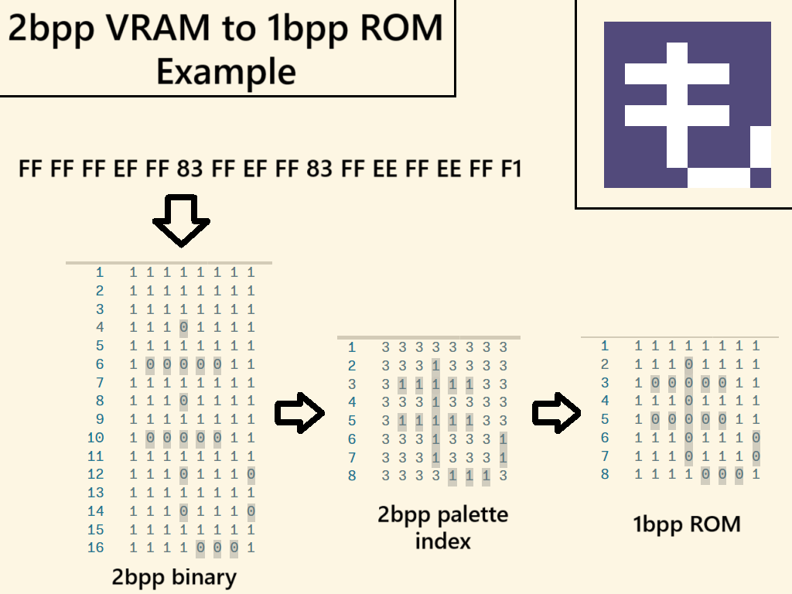

# General Housekeeping

Address prefixes, for sake of reader sanity:
* **loROM** - 24-bit memory mapped address
* **PRG** - Linear ROM address
* **WRAM** - Work RAM
* **REL** - Relative address
* **VRAM** - Video RAM

(Warning/Apology: these notes are very scattered currently. Once I work out the entire text printing process and encoding, I'll try to organize them)

# Disassembly Notes
* Game uses **loROM** mapping, a lot of the code execution seems to happen in the **loROM** banks `$80`-`$85`
* First dialogue blob lives at **PRG**`$060000` in the ROM and is mapped to **loROM** addresses, `$0C8000`, `$4C8000`, `$8C8000`, and `$CC8000`
    * Possibly ends at **PRG**`$067F90`, there's a bunch of `$FF` byte padding until the end of the bank, and this lines up with the four **loROM** mapping locations
* Another Dialogue blob lives at **PRG**`$070000`
    * TODO Figure out what triggers flipping to this set vs **PRG**`$060000`
        * The opening sequence seems to flip between the two for some reason
        * At **loROM**`$82F87A` there's a pointer loaded from **WRAM**`$0007D`
        * There seems to be quite a long string of Things that happen to get to that point. Setting *DB* to `$BD` is something to keep in mind, as it seems to be important when the above. My guess is that this is a table to assist in pointing where to load a dialogue blob from? Going to need some more investigation
    * At **loROM**`$81FCCD`, there's a hardcoded `LDA #$8E`
        * Next at **loROM**`$81FCDF` there's a hardcoded `LDX #$8000`
        * Next The accumulator value (currently `$8E`) is pushed to the stack, and then immediately pulled back into the *DB* register (in other words, it's explicitly changing execution to a new memory bank)
        * Between *X* = `$8000` and *DB* = `$8E` the upcoming `LDA $0000,X` is now pointing to **loROM**`$8E8000` or, **PRG**`$070000`!
            * So that's HOW it's set, still need to figure out WHY this gets set
* More potential Dialogue blobs to investigate
    * Between **loROM**`$81FCAD` to **loROM**`$81FD16` there's possibly other references to look into
    * **loROM**`$A8BF75` (**PRG**`$143F75`) set at **loROM**`$81FCFB,$81FCFD`
    * **loROM**`$A3F239` (**PRG**`$11F239`) set at **loROM**`$81FCE9,$81FCEC`
    * **loROM**`$8FF524` (**PRG**`$07F524`) set at **loROM**`$81FCF1,$81FCF3`
    * **loROM**`$97F524` (**PRG**`$0BF524`) set at **loROM**`$81FD05,$81FD07`
    * **loROM**`$8FA2A6` (**PRG**`$07A2A6`) set at **loROM**`$81FD05,$81FD07`

* **WRAM**`$00043` is a counter used to control text printing speed
    * When starting a new file you pick message speed 1-7, 1 sets the counter to `$01` (fastest), 4 (default) sets the counter to `$07`, 7 sets the counter to `$0D` (slowest)
    * Setting adjusts the counter in increments of `$02`
    * Counter is decremented at **loROM**`$85C07B`
    * Counter value is reset at **loROM**`$818FFF`
    * At **loROM**`$819008`, there is a loop that might be for idling until *NMI*, to start the *VBLANK* routine
        * Loop ends if counter `$43` is set to 0 (zero flag set in *status* register)
        * Immediately after this loop **loROM**`$851876` is set to zero (why?)
        * *A*, *Y*, *X* register states are restored from the stack and returns from the subroutine
* **WRAM**`$00021` seems to be important
    * When **WRAM**`$00021` is `$FD` execution is lead to **loROM**`$81FC7B` which is one of the text handling routines
* At **loROM**`$818CDF` is an LDA instruction that references the address where font graphics are stored
    * **loROM**`$8B8000` or **PRG**`$058000`
    * There actually appears to be a few other references in the same block of code, TODO look into how those are different if at all
* **loROM**`$8186F0` appears to be the exact instruction that will read in a text byte from ROM
    * This is accomplished using a pointer stored at **WRAM**`$00006` (aka load the address stored at address **WRAM**`$00006`)
    * The address seems to be an offset relative to the current diaglogue blob, and is used to track how far within a dialogue blob we are
        * ex. if reading from **loROM**`$8C8000` (**PRG**`$060000`), relative address `$8000` will be stored at **WRAM**`$000006`and incremented each time a byte is read
* **loROM**`$7F2600` (**WRAM**`$12600`) seems to be the designated region of WRAM where tile data for characters is chucked to before it's DMA'd to VRAM
    * Seems to always use DMA Channel 7 for text drawing
    * A -> B transfer where A is set to `$7F2600` and B is set to `$18`
    * Dialogue Boxes have 3 lines, and **VRAM**`$2600-$31DF` seems to be the area used for drawing text characters (during the opening sequence at least, if the dialogue box is somewhere else, will this change?)
    * Addresses used to store/load DMA parameters in **WRAM**
        * **WRAM**`$0002E` - VRAM destination address
        * **WRAM**`$00030` - A Bus Address
        * **WRAM**`$00032` - A Bus Bank
        * **WRAM**`$00033` - Transfer Size
        * **WRAM**`$00035` - Another VRAM destination address (what makes this one different?)
        * **WRAM**`$00037` - Another A Bus Address
        * **WRAM**`$00039` - Another A Bus Bank
        * **WRAM**`$0003A` - Another Transfer size
* Around **loROM**`$818065`, this may be a routine for setting up tile data for the dialogue boxes
    * It spends a lot of time filling in `$FF` bytes between **WRAM**`$12420,$133CF`. This lines up very well with where character data is plopped into
* **WRAM**`$000CE` may be use for flags of some sort?
* Keep an eye on **WRAM**`$0002D`, it's checked at **loROM**`$85C037` and 
    * **WRAM**`$0002D` is manually set to `#$03` at **loROM**`$818155`
    * This may be some sort of flag to signal that it's time to initiate DMA
* Keep an eye on **WRAM**`$00017` explicitely check if it's `#$3C` at **loROM**`$85C1E2`
    * Once it hits that value, it's reset to `$00`, and then **WRAM**`$00018` is loaded, incremented and checked if it's `#$3C`
    * This process keeps repeating until **WRAM**`$00018` equals `#$3C`, and then **WRAM**`$00019` goes through this same process
    * Once **WRAM**`$00019` equals `#$3C` execution jumps to **loROM**`$85C204`, which hasn't been encountered yet
        * But once it does, **WRAM**`$0001A` is incremented once
    * Aha Moment: These bytes may be counters for tracking play time. `$3C` is 60 in decimal, and there's the right number of checks for it to be counting seconds, minutes, and hours
* At **loROM**`$818670` there's a data copying step, that seems to use some hardcoded settings
    * `$03FF` bytes of data are copied from **PRG**`$12C9AE` (**loROM**`$7FC9AE`) to **WRAM**`$10000`
    * Unclear if this is relevant to text drawing, but keeping an eye on it none the less

# Text Encoding Notes
* `$0D` is a special byte, that might be related to character name settings. When encountered, execution will eventually jump to **loROM**`$818AC8`, where it does some additional prep work before loading the next byte (TODO document that more when brain isn't fried), which will be which character name to draw
    * `$05`- Main character (Kamekichi)
        * When encountered, **WRAM**`$00006` will be loaded with pointer `$0100`, meaning that character names are stored starting at **WRAM**`$00100`
* `$FD`, `$FE`, and `$FF` are special bytes which indicate a reference to a table of mostly Kanji characters, but also other strings as well
    * Dr. Poe's name during the intro is one of these special cases, it will print the unique "Dr" character and then Kanji aftwards, possibly at least 3 bytes worth of characters?
    * When one of these three bytes are loaded, the following happens
        1. When byte is determined to not be a control character, (aka greater than or equal to `$10`), push *A* to the stack to remember it's value (in this example `$FD` TODO document what happens with the other two bytes)
        2. Check if byte is greater than or equal to `$FD` (at **loROM**`$818728`)
        3. If so, load the next byte, and store that value at **WRAM**`$018DA`
        4. Push *DB* (the current bank) to the stack, and switch *DB* to bank `$A2`
        5. Load the value at **loROM**`$A2FDCC` (**PRG**`$117DCC`) into *X*
        6. The value in *X* is use to load from an offset of **loROM**`$A2FDCA` (**PRG**`$117DF8`) into *A*
        7. If *A* happens to be `$00`, jump execution to **loROM**`$818788`
            * `$00` seems to indicate the end of the table, so this means nothing was found in the table?
        8. Otherwise compare it to **WRAM**`$018DA` (the byte that was immediately after `$FD` in this example), and if it's equal to that byte, jump execution to **loROM**`$81874A`
        9. If less than the stored byte, increment *X* three times, then jump back to Step 6, and repeat (This is very like the kanji table lookup routine!)
            * The Kanji tables are documented in [kanji_table_notes.md](kanji_table_notes.md)
            * Each "row" is three bytes, first byte is the index, and the second two form the reference value
        10. Once a matching index byte is found, the reference value is loaded to **WRAM**`$018DC`
        11. Next, the previous bank value is pulled from the stack and loaded to *DB*, the Kanji Table special byte is pulled from the stack into *A*
        12. Execution jumps to **loROM**`$818A5D`
        13. *DB* is changed to `$A2` again
        14. The reference value previously stored in **WRAM**`$018DC`is loaded to *X* and used as an offset to against another load to **loROM**`$A2FDCA` (another table?), and that value is stored in **WRAM**`$018DE`
        15. Then, the reference value from the table is incremented by 1, copied into *A*, and `#$FDCA` is added (with carry) to *A* (why?)
        16. This new value is stored at **WRAM**`$00006` (the value used to track offset in dialogue blob was copied to the stack earlier), this new value appears to be used to track where the next byte will be?
        17. If the value stored at **WRAM**`$018DE` is zero, jump execution to **loROM**`$818AB4`
        18. If not, decrement the value at **WRAM**`$018DE`, and using the pointer stored at **WRAM**`$00006`, load the next byte
        19. If this byte is `$00` jump to **loROM**`$818AAF` (has not been encountered in disassembly yet)
        20. If not, check if it's greater than or equal to 10, and if yes, jump to **loROM**`$818AA3`
        21. Next, check if the byte is less than `$FD`, and jump to **loROM**`$818AAA` if less
        22. If `$FD` or higher, decrement the value at **WRAM**`$018DE`
        23. Once that's done, jump to the TEXT2 subroutine (**loROM**`$818C2C`)
* `$00` is a special byte to signal the end of a "chunk" of text, and to stop reading any further
    * When a `$00` is encountered, execution jumps to near the end of the **TEXT1** subroutine (**loROM**`$818793`) where it restores previous register status, and returns from the subroutine
* `$01`, `$02`, and `$03` seem to be special control bytes that are present at the beginning of a "chunk" of text
    * When one of these is loaded it's decremented by one, execution jumps to **loROM**`$8187B8`, which stores this value at **WRAM**`$01878` and jumps back to **loROM**`$8186EE` where the next byte is loaded
    * From what I can tell, it seems to be used to determing what "type/size" of character to draw. At the start of TEXT2 (**loROM**`$818C2C`), this value is used to read from a small table that starts at **PRG**`$058000`, which is then loaded to gets loaded to **WRAM**`$01901`
        * `$02` (`$03`) - draws 16x12 characters  (for the regular dialogue boxes)
            * `$03C6` gets loaded to **WRAM**`$01901`
        * `$01` (`$02`) - draws 8x16 characters
            * `$01E6` gets loaded to **WRAM**`$01901`
            * When toggling a `$03` manually to `$02` in ROM, the game has no issue printing these characters in regular dialogue boxes! This is REALLY GOOD because it means the text drawing code can already handle 8x16 fonts (!!)
        * `$00` (`$01`) - draws 8x8 characters (not sure where these show up yet)
            * `$0006` gets loaded to **WRAM**`$01901`
* `$10` - This is the "space" byte, however, in the decoding logic, if the byte is found to be higher than `$10`, it's treated differently
    * When it's less, the value is decremented by one, left arethmetic shifted once, and jumps to an offset relative to that new value via a pointer `($879C,X)` (yeesh, but seems to be where special byte handling happens)
    * When it's greater than `$10` it's likely that this means it's a drawable character, and less than are non-drawable control characters
* `$0F` - This is specifically checked for (at **loROM**`$818703`)
    * If found execution does an explicit long jump to **loROM**`$818A29`, which as not yet been encountered in my disassembly
    * TODO Figure out what this that chunk of code does once it's finally encountered
        * First occurance within a dialogue blob appears to be at **PRG**`$060640` (**loROM**`$8C8640`)
* Text characters appear to be stored in a 1bpp format in ROM, but are converted to 2bpp before being DMA'd to VRAM
    * Bitplane 1 seems to always be rows of `$FF` and Bitplane 2 follows the actual character pixels. Example of an 8x8 character stored at **VRAM**`$00E0`: 

